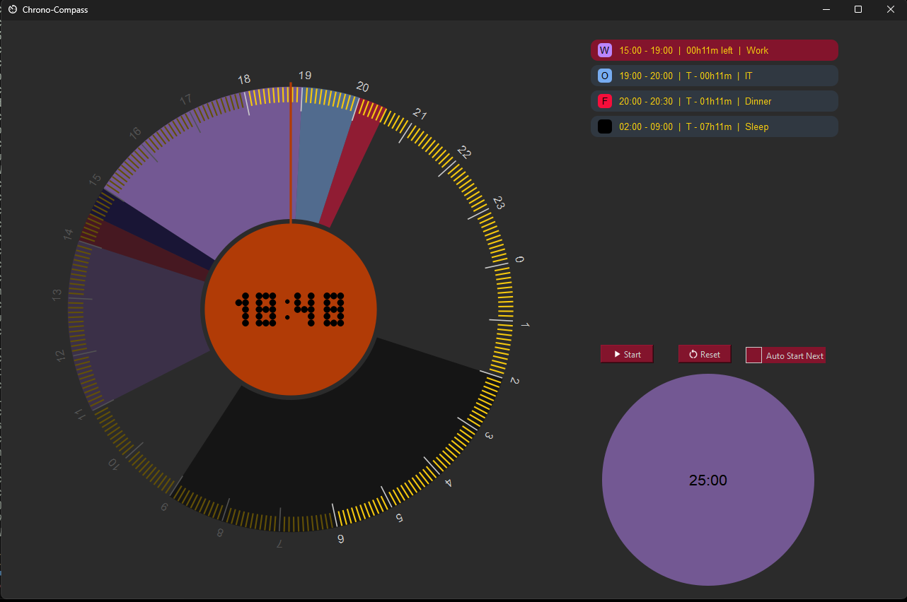

# Chrono-Compass

A simple and portable app to visualize and organize your day with an integrated pomodoro timer. This app was built to suit my peculiar needs for an app to visualize my schedule and help me keep track of time. It was my first time doing a UI (it is simple and not particularly pretty). 

If you encounter a bug, feel free to open an issue or a pull request. All contributions are welcome and an opportunity for me to learn.



# Requirements

To install all requirements with pip run:

```sh
pip install -r requirements.txt
```

# How to use

You can run *main.py* as a python script or build an executable (see below). Use the .csv files inside the *week_schedules/* folder to insert your events. The philosophy for this app is that daily schedules start/end when you wake up/go to sleep and not at midnight. This means that, by default, days "start" at 06:00. For example, an event occurring at 02:00 on a Tuesday should be inserted on Monday's .csv.

If you want a sound to play, just copy a .wav file named *sound.wav* inside the directory where *main.py* (or the executable if you're using that) is. I don't include one due to copyright concerns.

# Create an executable

## Using cx_freeze

First install [cx_Freeze](https://github.com/marcelotduarte/cx_Freeze). If you use Python 3.12, you have to use the development build.

```sh
# For Python <= 3.11
pip install cx_freeze
# For Python >= 3.12 
pip install --upgrade --pre --extra-index-url https://marcelotduarte.github.io/packages/ cx_Freeze 
```

Then build the executable.

```sh
python setup.py build
```

## Using PyInstaller

Using [PyInstaller](https://pyinstaller.org/en/stable/) might not work on Windows because some antivirus flag the executable as Trojan.

To create an executable, first install pyinstaller.
```sh
pip install pyinstaller
```

Then build the executable.

```sh
pyinstaller --clean --windowed --name "Chrono-Compass" --icon _internal/icon.ico --add-data ./_internal/icon.png:. --add-data ./_internal/play.png:. --add-data ./_internal/pause.png:. --add-data ./_internal/reset.png:. --add-data week_schedules/:./week_schedules/ main.py
```

Finally, copy the *week_schedules/* into the created *Chrono-Compass/* inside *dist/*.

# License

- Freely available under [Apache License Version 2.0](https://www.apache.org/licenses/LICENSE-2.0.txt);
- Some icons from [material-design-icons](https://github.com/google/material-design-icons/tree/master?tab=readme-ov-file) included under [Apache License Version 2.0](https://www.apache.org/licenses/LICENSE-2.0.txt).
